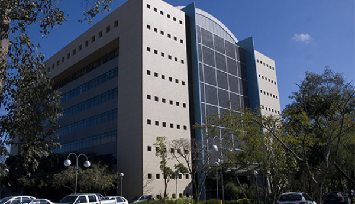
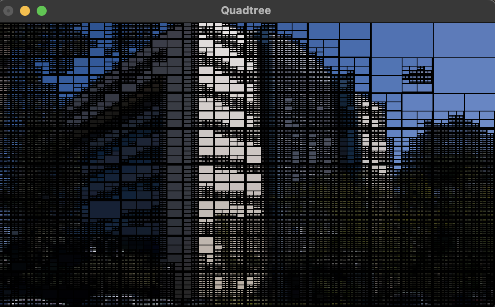
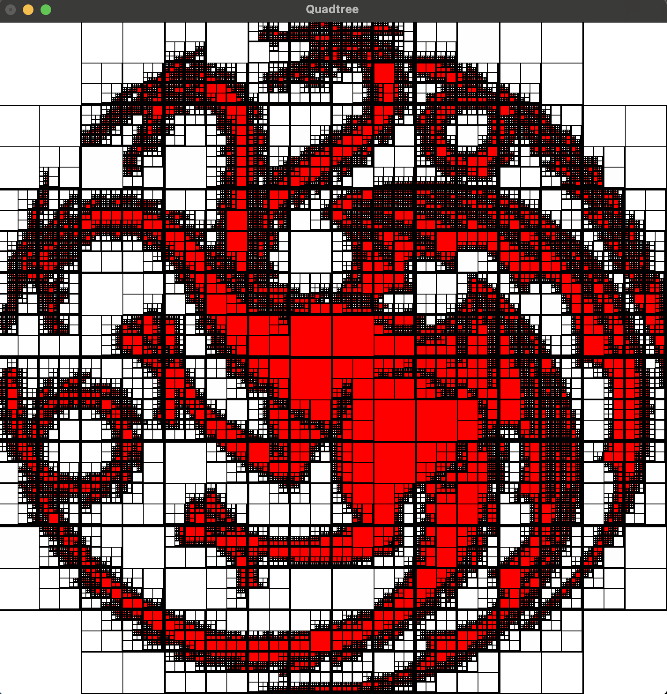
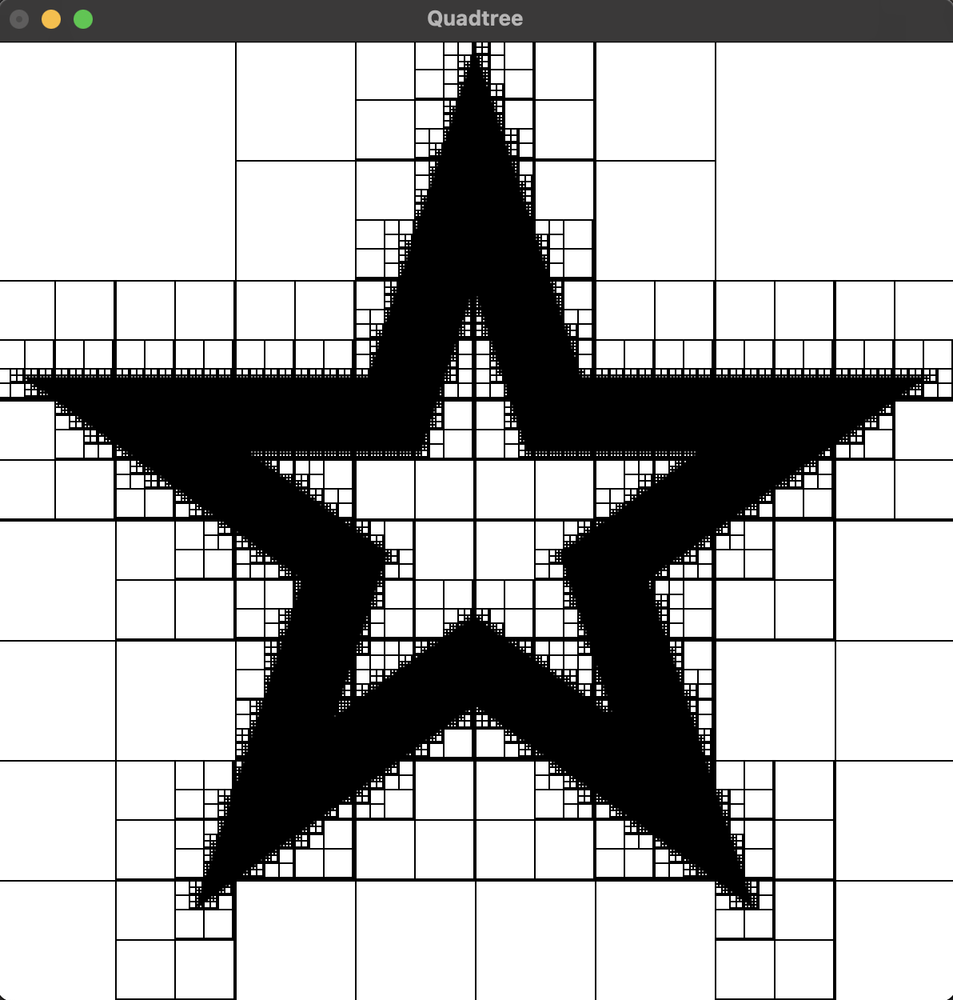
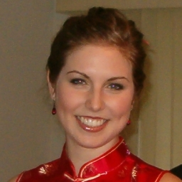
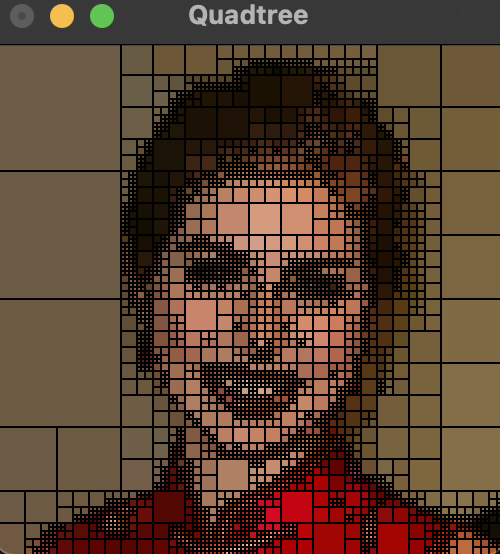

# QuadTree
Trabalho 2 da disciplina de Software Básico.

O objetivo deste trabalho era a realização de um programa na linguagem C que replica-se uma quadtree.

Para isso, faz-se necessário analisar a imagem em tons de cinza e realizar um histograma a partir dessa análise.

Com isso, calculamos a cor média e obtemos um erro. Caso o erro encontrado for maior que o erro inicial do sistema, que é controlado pelo usuário, sendo alterado pelas teclas de "+" ou "-", a imagem é dividida em quatro quadrantes. Com isso, ela vai se dividindo recursivamente até formar a imagem por si.

Segue exemplos das imagens formadas pelo programa.

Prédio 32:

Sigil:

Prédio 32:

Prédio 32:

